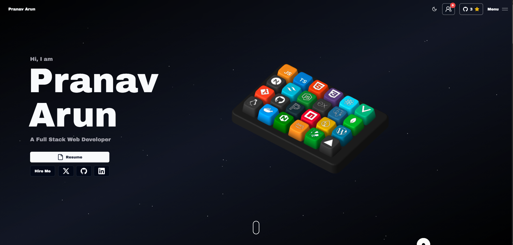

# My Portfolio Website

[](https://github.com/toxicbishop/Portfolio-2/actions/workflows/ci.yml)


Welcome to the repository for my personal portfolio website! This is where I showcase my skills, projects, and a bit of my personality through jaw-dropping 3D animations, slick interactions, and fluid motion. If you're into creative web design, you're in the right place.



## Features

- **3D Animations**: Custom-made interactive keyboard using Spline with skills as keycaps that reveal titles and descriptions on hover.
- **Slick Interactions**: Powered by GSAP and Framer Motion for smooth animations on scroll, hover, and element reveal.
- **Space Theme**: Particles on a dark background to simulate a cosmic environment, making the experience out of this world.
- **Responsive Design**: Fully responsive across all devices to ensure the best user experience.
- **Innovative Web Design**: Combining creativity with functionality to push the boundaries of modern web design.

## Tech Stack

- **Frontend**: Next.js, React, Tailwind CSS, Shadcn, Aceternity UI
- **Animations**: GSAP, Framer Motion, Spline Runtime
- **Misc**: Resend, Socketio, Zod

## Getting Started

### Prerequisites

- Node.js (v18+)
- npm, yarn, or pnpm

### Installation

1. Clone the repository:

   ```bash
   git clone https://github.com/toxicbishop/Portfolio-2.git
   ```

2. Navigate to the project directory:

   ```bash
   cd Portfolio-2
   ```

3. Install dependencies (choose one):

   ```bash
   npm install
   # or
   yarn install
   # or
   pnpm install
   ```

4. Run the development server:

   ```bash
   npm run dev
   # or
   yarn dev
   # or
   pnpm dev
   ```

5. Open [http://localhost:3000](http://localhost:3000) in your browser to see the magic!

6. **Upload your resume**: Replace the placeholder resume (or add your own) at `public/assets/resume.pdf`. This file is ignored by git to keep your personal information private when you push to your own repository.

## Project Structure

```
.
├── public
│   └── assets           # Images, 3D models (.spline), and icons
├── src
│   ├── app              # Next.js App Router pages
│   ├── components       # React components
│   │   ├── header       # Navigation bar
│   │   ├── footer       # Footer component
│   │   ├── sections     # Landing page sections (Hero, Skills, Projects, etc.)
│   │   └── ui           # UI components (Buttons, Modals, Tooltips)
│   ├── data             # Static data files (Projects config, Site config)
│   ├── hooks            # Custom React hooks
│   ├── lib              # Utility functions
│   └── styles           # Global styles
├── next.config.mjs      # Next.js configuration
├── tailwind.config.ts   # Tailwind CSS configuration
└── tsconfig.json        # TypeScript configuration
```

## Deployment

This site is deployed on Vercel. For your own deployment, follow these steps:

1. Push your code to a GitHub repository.
2. Connect your repository to Vercel.
3. Vercel will handle the deployment process.

## Contributing

If you'd like to contribute or suggest improvements, feel free to open an issue or submit a pull request. All contributions are welcome!

## License

This project is open source and available under the [MIT License](LICENSE).
